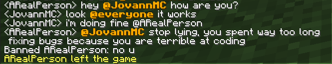

# MentionChat

A lightweight Spigot plugin that allows players to mention other players in chat.  

## Description

A simple and open source plugin that allows players to mention other players in chat, which is in basically every chat platform. You can configure the messages, cooldown time, let players customize their settings, and more!

    
config.yml

    # MentionChat config.yml
    # Thanks for downloading my plugin!

    # Prefix for MentionChat commands.
    prefix: "&6[&eMentionChat&6]&r"

    # Should the plugin check for updates on startup?
    # You can always check for updates manually with /mentionchat (info).
    checkForUpdates: true

    # What should be placed at the beginning of the message to mention somebody?
    # To disable the mention symbol (and use just the player's name), leave it blank.
    # Note: leaving it blank can cause any player with the permission mentionchat.mention.everyone to trigger an everyone mention unintentionally.
    mentionSymbol: "@"

    # What should the default format for the message be?
    # This can be overridden by players in game with /mentionchat settings format <format>
    # %mention% is the placeholder of the mentioned player or everyone.
    mentionFormat: "&6&l%mention%&r"

    # When you are mentioned, play this sound. No sound will be played when someone is mentioned and an error will appear if an invalid sound is chosen.
    # This can be overridden by players in game with /mentionchat settings sound <sound>
    # To disable the sound, put NONE.
    mentionedSound: ENTITY_ARROW_HIT_PLAYER

    # How much time (in seconds) should there be in between mentions?
    # Used to prevent mention spam.
    # To disable the cooldown, put 0.
    cooldown: 3

    # What should you see when you try to mention someone who has mentions disabled, or has the permission mentionchat.mention.exempt
    # %mention% is the placeholder of the mentioned player(s).
    playerMentionDisabled: "&4%mention% has mentions disabled!"

    # What should you see when you try to mention people during the cooldown?
    cooldownMessage: "&4Please don't try to spam mention people."

    # When you don't have permission to mention someone, send this message:
    noPermissionMessage: "&4You don't have permission to mention them!"

    # DO NOT TOUCH THIS
    configVersion: 3

    
config-legacy.yml

    # MentionChat config.yml (for legacy versions)
    # Thanks for downloading my plugin!

    # Prefix for MentionChat commands.
    prefix: "&6[&eMentionChat&6]&r"

    # Should the plugin check for updates on startup?
    # You can always check for updates manually with /mentionchat.
    checkForUpdates: true

    # What should be placed at the beginning of the message to mention somebody?
    # To disable the mention symbol (and use just the player's name), leave it blank.
    # Note: leaving it blank can cause any player with the permission mentionchat.mention.everyone to trigger an everyone mention unintentionally.
    mentionSymbol: "@"

    # What should the format for the message be?
    # %mention% is the placeholder of the mentioned player or everyone.
    mentionFormat: "&6&l%mention%&r"

    # When you are mentioned, play this sound. No sound will be played when someone is mentioned and an error will appear if an invalid sound is chosen.
    # To disable the sound, put NONE.
    mentionedSound: SUCCESSFUL_HIT

    # How much time (in seconds) should there be in between mentions?
    # Used to prevent mention spam.
    # To disable the cooldown, put 0.
    cooldown: 3

    # What should you see when you try to mention someone who has mentions disabled, or has the permission mentionchat.mention.exempt
    # %mention% is the placeholder of the mentioned player(s).
    playerMentionDisabled: "&4%mention% has mentions disabled!"

    # What should you see when you try to mention people during the cooldown?
    cooldownMessage: "&4Please don't try to spam mention people."

    # When you don't have permission to mention someone, send this message:
    noPermissionMessage: "&4You don't have permission to mention them!"

    # DO NOT TOUCH THIS
    configVersion: 3

## Commands

- `/mentionchat (info)` - View MentionChat's info and perform an update check.
- `/mentionchat help (1/2)` - View the MentionChat help page
- `/mentionchat reload` - Reload MentionChat's config.
- `/mentionchat settings <toggle/format/sound>` - Lets players manage their settings for MentionChat

## Permissions

- `mentionchat.*` - Gives access to all of MentionChat's permissions and commands (except for `mentionchat.mention.exempt`). Default is `OP`.
- `mentionchat.command.info` - Allows players to view MentionChat's info and perform an update check. Default is `everyone`.
- `mentionchat.command.reload` - Allows players to reload MentionChat's config. Default is `OP`.
- `mentionchat.command.help` - Allows players to view MentionChat's help page. Default is `everyone`.
- `mentionchat.command.settings` - Allows players to modify their settings for MentionChat. Default is `everyone`.
- `mentionchat.command.settings.toggle` - Allows players to toggle their mentions on and off. Default is `everyone`.
- `mentionchat.command.settings.format` - Allows players to change their mention format. Default is `everyone`.
- `mentionchat.command.settings.sound` - Allows players to change their mention sound. Default is `everyone`.
- `mentionchat.mention.others` - Allows you to mention other players. Default is `everyone`.
- `mentionchat.mention.everyone` - Allows you to mention everyone. Default is `OP`.
- `mentionchat.mention.exempt` - Allows players to be exempt from being mentioned, no matter their mention toggle. Default is `no one`.
- `mentionchat.mention.bypass` - Allows players to bypass the cooldown between mentions, mention toggles, and exempt permission node. Default is `OP`.
- `mentionchat.mention.bypass.cooldown` - Allows players to bypass the cooldown between mentions. Default is `OP`.
- `mentionchat.mention.bypass.toggle` - Allows players to bypass the mention toggle. Default is `OP`.
- `mentionchat.mention.bypass.exempt` - Allows players to bypass the mention exemption permission node. Default is `OP`.

## License

This project is licensed under the [MIT](https://opensource.org/license/mit/) License - see the [LICENSE.md](LICENSE.md) file for details.

